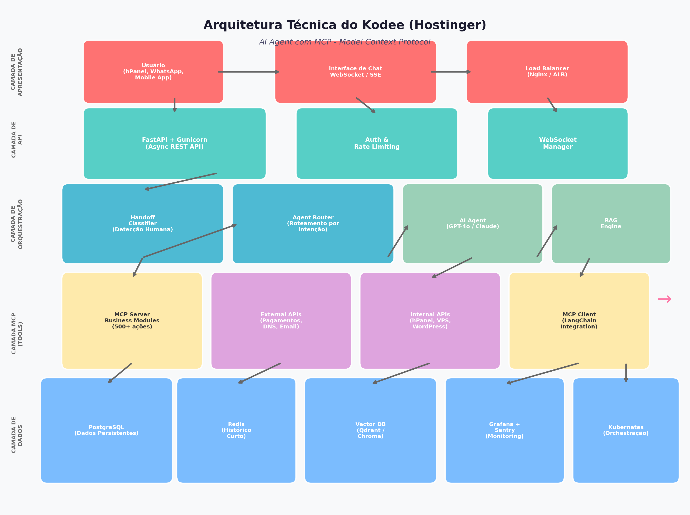
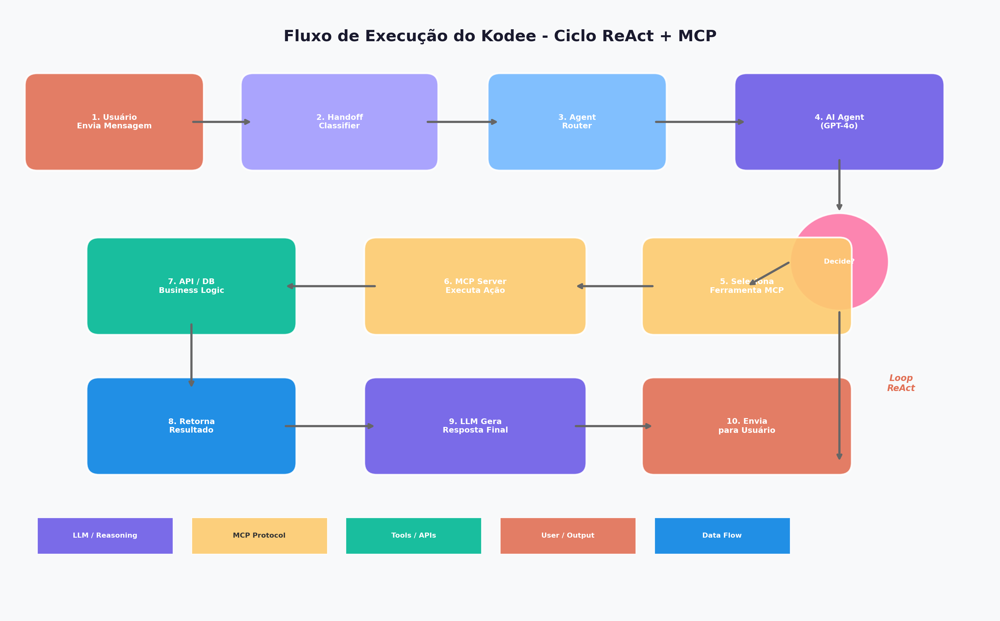

# Arquitetura Técnica do Kodee (Hostinger) e Guia de Replicação

## TL;DR

O **Kodee** é um agente de IA da Hostinger que resolve **81% das interações de suporte** (cerca de **€9 milhões em economia anuais**), executando **mais de 500 ações administrativas** via **Model Context Protocol (MCP)**. A arquitetura é composta por: **FastAPI** como camada de API, **LLM (GPT-4o/Claude)** para raciocínio, **MCP** como ponte para ferramentas, **RAG** com vetor database para reduzir alucinações, e **Kubernetes** para orquestração. A replicação em ambiente próprio exige aproximadamente **2-4 semanas** de desenvolvimento usando **Python + FastAPI + LangChain + MCP SDK**, com custos estimados de **$500-2.000/mês** para operação em produção.

---

## 1. Visão Geral do Kodee

### 1.1 O que é o Kodee

O Kodee é o agente de inteligência artificial da Hostinger que evoluiu de um simples chatbot baseado em Rasa para um dos assistentes de IA mais avançados do setor de hosting. Inicialmente lançado como um sistema híbrido combinando Rasa com GPT-3.5, o Kodee passou por uma transição completa para uma **arquitetura baseada exclusivamente em LLM** em setembro de 2023, o que permitiu lidar com consultas mais complexas e dinâmicas sem depender de fluxos predefinidos. A transição de um sistema baseado em regras para um agente autônomo representa uma mudança fundamental na forma como empresas de tecnologia podem escalar o suporte ao cliente sem aumentar proporcionalmente a equipe humana.

O diferencial do Kodee está na capacidade de **executar ações reais** no ambiente do usuário, não apenas fornecer respostas textuais. Ele realiza migrações de sites, cria backups, configura DNS, instala plugins WordPress, verifica a saúde de servidores e gerencia pagamentos — tudo através de uma interface de chat conversacional. Essa abordagem "agentica" transforma o assistente de uma mera fonte de informação em um verdadeiro **administrador de sistemas virtual**.

| Métrica | Valor | Período |
|---------|-------|---------|
| **Interações resolvidas** | 81% | Final de 2025  [(CXOToday.com)](https://cxotoday.com/media-coverage/hostinger-posts-fourth-consecutive-year-of-50-growth-driven-by-platform-wide-ai-agent-use/)  |
| **Ações administrativas** | 500+ | Acumulado  [(Hostinger)](https://www.hostinger.com/kodee)  |
| **Economia anual** | ~€9 milhões | 2025  [(CXOToday.com)](https://cxotoday.com/media-coverage/hostinger-posts-fourth-consecutive-year-of-50-growth-driven-by-platform-wide-ai-agent-use/)  |
| **Tempo médio de resposta** | 9 segundos | 2025  [(Hostinger)](https://www.hostinger.com/kodee)  |
| **Satisfação do cliente** | 77% (CSAT) | 2025  [(Hostinger)](https://www.hostinger.com/kodee)  |
| **Usuários atendidos** | 4.6 milhões | Base global  [(Hosting Discussion)](https://hostingdiscussion.com/news/hostinger-posts-325m-in-2025-revenue-as-ai-integration-global-demand-fuel-continued-expansion/)  |
| **Crescimento de adoção** | 50% → 81% | Jan-Dez 2025  [(Hosting Discussion)](https://hostingdiscussion.com/news/hostinger-posts-325m-in-2025-revenue-as-ai-integration-global-demand-fuel-continued-expansion/)  |

### 1.2 Evolução Arquitetural

A trajetória do Kodee ilustra uma lição valiosa sobre a evolução de sistemas de IA. A primeira iteração utilizava **Rasa**, um framework de IA conversacional open-source baseado em processamento de linguagem natural tradicional. O Rasa funcionava com um modelo de intenção-ação: o sistema classificava a mensagem do usuário em intenções predefinidas e executava ações correspondentes. Essa abordagem, embora funcional para cenários limitados, quebrava quando os usuários desviavam dos scripts predefinidos.

A transição para um **sistema LLM-only** removeu a rigidez do Rasa, permitindo que o assistente entendesse nuances, contextos implícitos e solicitações não previstas. A Hostinger documentou que essa mudança permitiu ao Kodee atender a **consultas mais complexas** e reduzir drasticamente o número de fallbacks que exigiam intervenção humana. A lição fundamental é que sistemas baseados em regras têm um teto de complexidade inerente, enquanto sistemas LLM-based podem escalar sua capacidade de compreensão proporcionalmente ao modelo subjacente.

---

## 2. Arquitetura Técnica Detalhada

### 2.1 Visão Arquitetural de Alto Nível

A arquitetura do Kodee segue um padrão de **cinco camadas** bem definidas, cada uma com responsabilidades claras e interfaces estandardizadas. A separação de concerns é fundamental para a manutenibilidade e escalabilidade do sistema.



A arquitetura completa pode ser visualizada no diagrama acima, que ilustra as cinco camadas principais: **Apresentação**, **API**, **Orquestração**, **MCP (Tools)** e **Dados**. Cada camada se comunica com as adjacentes através de interfaces bem definidas, permitindo a substituição independente de componentes.

### 2.2 Componentes Core e Suas Funções

#### 2.2.1 FastAPI - Camada de API

A Hostinger utiliza **FastAPI** como framework principal para construção das APIs do Kodee, combinado com **Gunicorn** como servidor WSGI/HTTP. A escolha do FastAPI é estratégica: ele oferece suporte nativo a operações **assíncronas**, que são essenciais quando se trabalha com LLMs, onde cada requisição pode envolver múltiplas chamadas de modelo com latência significativa. FastAPI também gera documentação Swagger/OpenAPI automaticamente, facilita a validação de dados com Pydantic e oferece performance comparável a frameworks Node.js  [(Hostinger)](https://www.hostinger.com/blog/building-kodee) .

A camada de API é responsável por receber as mensagens dos usuários através de múltiplos canais (hPanel, WhatsApp, mobile app), autenticar as requisições, aplicar rate limiting e encaminhar as mensagens para o sistema de orquestração. A arquitetura assíncrona permite que o sistema manipule **centenas de requisições concorrentes** sem bloquear threads, um requisito crítico para um serviço de chat em tempo real.

#### 2.2.2 Handoff Classifier - Detecção de Necessidade Humana

Desde a primeira mensagem, o sistema monitora constantemente a conversa para avaliar se o usuário está buscando assistência humana. O **Handoff Classifier** é um componente crítico que avalia a intenção do usuário através da função `is_seeking_human_assistance`. Se o sistema determina que o usuário prefere falar com um agente humano, a função `get_handoff_response_message` gera uma mensagem apropriada para informar sobre a transição  [(Hostinger)](https://www.hostinger.com/blog/building-kodee) .

Esse componente é essencial para manter a satisfação do cliente. Um sistema que não reconhece quando o usuário está frustrado ou quando o problema está além de sua capacidade pode causar danos significativos à experiência do cliente. O classifier utiliza o próprio LLM para analisar o sentimento e o contexto da conversa, determinando o momento ótimo para escalonar.

#### 2.2.3 Agent Router - Roteamento por Intenção

O **Agent Router** classifica a mensagem do usuário e decide qual **AI agent especializado** deve processar o chat. Se um usuário pergunta sobre um problema relacionado a domínios, a conversa recebe o rótulo "domain chatbot" e é encaminhada para o **DomainChatHandler**. Esse padrão de roteamento garante que cada tipo de consulta seja tratado por um agente com conhecimento especializado e ferramentas apropriadas para aquele domínio  [(Hostinger)](https://www.hostinger.com/blog/building-kodee) .

O router implementa o padrão **Supervisor Pattern**, onde um agente coordenador (supervisor) analisa a entrada do usuário e direciona para o agente especializado mais adequado. Esse padrão é considerado o mais comum em produção porque a maioria das cargas de trabalho não exige "fazer cinco coisas ao mesmo tempo", mas sim "descobrir qual uma coisa fazer, e fazê-la bem"  [(DEV Community)](https://dev.to/thedailyagent/multi-agent-orchestration-a-guide-to-patterns-that-work-1h81) .

#### 2.2.4 AI Agent - Motor de Raciocínio LLM

O coração do Kodee é o **AI Agent** baseado em LLM (inicialmente GPT-4, posteriormente atualizado para GPT-4o e Claude). O agente processa a mensagem de entrada para gerar uma resposta inicial. Com base na entrada ou resposta inicial, o LLM identifica se precisa invocar alguma **função** — externa ou interna — para coletar informações ou executar uma operação. As funções incluem: chamar **APIs externas** para dados, executar **operações predefinidas** ou acessar **bancos de dados internos**, e executar **lógica de negócios específica**  [(Hostinger)](https://www.hostinger.com/blog/building-kodee) .

O resultado da execução da função é recuperado e passado de volta ao LLM, que utiliza os dados para refinar e gerar uma resposta final. O processo completo leva em média **20 segundos**, mesmo com o batching de mensagens. Esse ciclo de **Reasoning + Acting (ReAct)** é o padrão fundamental que permite ao agente tomar decisões dinâmicas em vez de seguir scripts predefinidos.



### 2.3 O Model Context Protocol (MCP) no Kodee

#### 2.3.1 O que é MCP e Por Que a Hostinger o Adotou

O **Model Context Protocol (MCP)** é um padrão open-source desenvolvido pela Anthropic que define como assistentes de IA se conectam a sistemas onde os dados residem — repositórios de conteúdo, ferramentas de negócios e ambientes de desenvolvimento. A Hostinger anunciou em setembro de 2025 que o Kodee utiliza o MCP para se conectar **diretamente às ferramentas e serviços Hostinger** com privilégios de administrador  [(Hostinger)](https://www.hostinger.com/blog/kodee-agentic-update) .

A adoção do MCP foi um divisor de águas porque resolveu um problema fundamental: como permitir que um LLM execute ações reais em sistemas externos de forma **padronizada, segura e extensível**. Antes do MCP, cada integração exigia código customizado, o que tornava o sistema difícil de manter e escalar. Com o MCP, novas ferramentas podem ser adicionadas simplesmente criando novos servidores MCP que seguem o protocolo padronizado.

#### 2.3.2 Arquitetura MCP: Client-Server

O MCP implementa uma **arquitetura cliente-servidor** que separa limpidamente os modelos de IA (clientes) das fontes de dados e ferramentas que acessam (servidores)  [(arXiv.org)](https://arxiv.org/html/2504.21030v1) .

| Componente | Função | Exemplo no Kodee |
|------------|--------|-----------------|
| **MCP Host** | A aplicação de IA que coordena e gerencia um ou mais clientes MCP | O agente LLM do Kodee |
| **MCP Client** | Interface inteligente integrada nas aplicações de IA, responsável por descobrir capacidades do servidor e facilitar troca de dados com LLMs | O componente que descobre ferramentas disponíveis e as apresenta ao LLM |
| **MCP Server** | Programa que fornece contexto aos clientes MCP, atuando como gateway para recursos empresariais, expondo ferramentas, fontes de dados e templates de prompts | Servidores MCP para DNS, pagamentos, backups, WordPress, etc.  [(OneReach.ai)](https://onereach.ai/blog/how-mcp-simplifies-ai-agent-development/)  |

A comunicação entre cliente e servidor segue o padrão **JSON-RPC 2.0**, um protocolo leve e eficiente que usa JSON para codificação de dados. Embora o JSON-RPC seja comumente implementado sobre HTTP, as implementações de referência MCP rodam sobre **stdio** por serem agnósticas de transporte — mas são projetadas para serem extensíveis, com potencial para WebSockets e outros transportes em iterações futuras  [(OneReach.ai)](https://onereach.ai/blog/how-mcp-simplifies-ai-agent-development/) .

#### 2.3.3 Primitivas MCP: Resources, Tools e Prompts

O MCP define um conjunto de primitivas padronizadas que fornecem os blocos de construção para gerenciamento de contexto  [(arXiv.org)](https://arxiv.org/html/2504.21030v1) :

**Primitivas do lado do servidor** definem as capacidades que os servidores MCP expõem aos clientes:

- **Prompts**: Instruções ou templates predefinidos que a IA pode solicitar. Incluem orientação situacional, instruções de formatação ou procedimentos especializados para tarefas particulares.
- **Resources**: Dados estruturados ou documentos que podem ser enviados ao modelo de IA. Artigos de base de conhecimento, registros de banco de dados, informações de configuração ou outros dados contextuais.
- **Tools**: Funções executáveis que a IA pode invocar para realizar ações ou recuperar informações. Incluem chamadas de API, consultas de banco de dados, operações de arquivo ou outras capacidades funcionais  [(arXiv.org)](https://arxiv.org/html/2504.21030v1) .

**Primitivas do lado do cliente** definem capacidades que os clientes MCP fornecem aos servidores:

- **Roots**: Pontos de entrada que dão aos servidores acesso a domínios de dados específicos no lado do cliente, estabelecendo limites de permissão.
- **Sampling**: Mecanismo que permite a um servidor MCP solicitar que o modelo de IA gere uma completion — capacidade poderosa que permite ao servidor "perguntar de volta"  [(arXiv.org)](https://arxiv.org/html/2504.21030v1) .

#### 2.3.4 Como o Kodee Usa MCP para 500+ Ações

O Kodee utiliza o MCP para expor **mais de 500 ações administrativas** através de servidores MCP especializados. Cada servidor MCP é responsável por um domínio específico de negócio:

- **MCP Server de DNS**: Ferramentas para criar, modificar e excluir registros DNS
- **MCP Server de Backups**: Ferramentas para criar, restaurar e agendar backups
- **MCP Server de WordPress**: Ferramentas para instalar plugins, temas e atualizações
- **MCP Server de VPS**: Ferramentas para monitorar saúde do servidor, reiniciar serviços
- **MCP Server de Pagamentos**: Ferramentas para gerenciar faturas, renovações e reembolsos

Cada ferramenta é definida com um nome, descrição, schema de parâmetros e tipo de retorno, permitindo que o LLM entenda seu propósito e uso. O LLM **não executa código diretamente** — ele *solicita* chamadas de ferramenta gerando saída estruturada que nomeia uma ferramenta e fornece argumentos. O framework executa a função Python correspondente e alimenta o resultado de volta ao LLM para raciocínio adicional  [(Retool)](https://retool.com/blog/agent-architecture) .

---

## 3. Stack Tecnológica Completa

### 3.1 Backend e Framework

| Componente | Tecnologia | Função | Justificativa |
|------------|-----------|--------|--------------|
| **Framework API** | FastAPI + Gunicorn | Camada de API REST assíncrona | Suporte nativo a async, validação Pydantic, documentação automática, performance  [(Hostinger)](https://www.hostinger.com/blog/building-kodee)  |
| **Linguagem** | Python 3.11+ | Linguagem principal | Ecossistema maduro para IA, integração com LangChain, OpenAI SDK  [(Hostinger)](https://www.hostinger.com/blog/building-kodee)  |
| **LLM** | GPT-4o / Claude 3.5 Sonnet | Motor de raciocínio | Capacidade avançada de tool calling, compreensão contextual, baixa latência  [(Hostinger)](https://www.hostinger.com/blog/building-kodee)  |
| **Framework LLM** | LangChain / LangGraph | Orquestração de agentes, chains, RAG | Abstração provider-agnostic, workflows complexos, integração MCP  [(FutureSmart AI Blog)](https://blog.futuresmart.ai/building-a-production-ready-rag-chatbot-with-fastapi-and-langchain)  |
| **Protocolo** | MCP (Model Context Protocol) | Conexão padronizada com ferramentas | Padrão open-source, descoberta dinâmica de ferramentas, separação de concerns  [(Hostinger)](https://www.hostinger.com/blog/kodee-agentic-update)  |
| **Servidor MCP** | FastMCP (Python SDK) | Implementação de servidores MCP | SDK oficial Python, decorators @tool, integração com FastAPI  [(Medium)](https://medium.com/@harshal.dhandrut/building-intelligent-ai-agents-with-mcp-a-complete-guide-to-the-model-context-protocol-5507069068fb)  |

### 3.2 Bancos de Dados e Cache

| Componente | Tecnologia | Função | Justificativa |
|------------|-----------|--------|--------------|
| **Banco relacional** | PostgreSQL + Alembic | Dados persistentes, histórico de conversas, metadados | Confiabilidade, transações ACID, migrações com Alembic  [(Hostinger)](https://www.hostinger.com/blog/building-kodee)  |
| **Cache/Memória** | Redis | Histórico curto de conversas, sessões, rate limiting | Armazenamento in-memory de alta velocidade, TTL nativo  [(Hostinger)](https://www.hostinger.com/blog/building-kodee)  |
| **Vector DB** | Qdrant / Chroma / pgvector | RAG, embeddings, busca semântica | Busca por similaridade, redução de alucinações  [(DEV Community)](https://dev.to/hamluk/building-production-ready-rag-in-fastapi-with-vector-databases-39gf)  |
| **Migrations** | Alembic | Gerenciamento de schema do banco | Controle de versão do schema, rollbacks, migrações programáticas  [(Hostinger)](https://www.hostinger.com/blog/building-kodee)  |

### 3.3 Infraestrutura e DevOps

| Componente | Tecnologia | Função | Justificativa |
|------------|-----------|--------|--------------|
| **Orquestração** | Kubernetes | Deploy, scaling, gestão de containers | Auto-scaling, self-healing, rolling updates  [(Hostinger)](https://www.hostinger.com/blog/building-kodee)  |
| **CI/CD** | GitHub Actions | Pipeline de build e deploy | Integração nativa com GitHub, runners gerenciados  [(Hostinger)](https://www.hostinger.com/blog/building-kodee)  |
| **Container** | Docker | Containerização da aplicação | Consistência entre ambientes, isolation  [(Zen van Riel)](https://zenvanriel.com/ai-engineer-blog/deploying-ai-with-docker-fastapi/)  |
| **Monitoramento** | Grafana | Dashboards de métricas e performance | Visualização de métricas de negócio e técnicas  [(Hostinger)](https://www.hostinger.com/blog/building-kodee)  |
| **Error Tracking** | Sentry | Captura e análise de erros | Stack traces, agrupamento de erros, alertas  [(Hostinger)](https://www.hostinger.com/blog/building-kodee)  |
| **Logs** | OpenTelemetry / SIEM | Logging estruturado e tracing | Rastreabilidade completa, integração com SIEM  [(Comet ML)](https://www.comet.com/site/blog/ai-agent-evaluation/)  |

### 3.4 Arquitetura Multi-Agente do Kodee

O Kodee implementa uma **arquitetura multi-agente** com agentes especializados que colaboram para resolver problemas complexos. Além do Kodee principal, a Hostinger desenvolveu cinco agentes especializados que podem ser acionados diretamente pelo Kodee  [(Hostinger)](https://www.hostinger.com/support/hostinger-ai-agents-features-and-overview/) :

| Agente | Especialidade | Quando é Acionado |
|--------|-------------|-------------------|
| **Kodee (Principal)** | Suporte geral, ações administrativas | Primeiro ponto de contato para todas as interações |
| **Scout** | SEO, keywords, rankings de busca | Quando o usuário menciona SEO ou rankings  [(Hostinger)](https://www.hostinger.com/support/hostinger-ai-agents-features-and-overview/)  |
| **Quill** | Blog posts, copy de site, conteúdo social | Para criação e edição de conteúdo  [(Hostinger)](https://www.hostinger.com/support/hostinger-ai-agents-features-and-overview/)  |
| **Buzz** | Geração de imagens | Quando o usuário solicita criação de imagens  [(Hostinger)](https://www.hostinger.com/support/hostinger-ai-agents-features-and-overview/)  |
| **Shield** | Termos de serviço, contratos, documentos legais | Para necessidades legais e privacidade  [(Hostinger)](https://www.hostinger.com/support/hostinger-ai-agents-features-and-overview/)  |
| **North** | Ideias de negócio, proposta de valor, estratégia | Para consultoria de negócios  [(Hostinger)](https://www.hostinger.com/support/hostinger-ai-agents-features-and-overview/)  |

Quando o Kodee detecta que uma solicitação se encaixa na especialidade de um agente, ele delega a tarefa em background e retorna o resultado na mesma conversa. Essa arquitetura de **delegação especializada** permite que cada agente seja otimizado para seu domínio específico, resultando em maior qualidade e precisão.

---

## 4. Como Replicar a Arquitetura do Kodee

### 4.1 Visão Geral da Replicação

Replicar a arquitetura do Kodee em um ambiente próprio requer aproximadamente **2-4 semanas** de desenvolvimento para um MVP funcional, e **6-8 semanas** para uma versão production-ready. O investimento total estimado varia entre **$15.000-40.000** em desenvolvimento (considerando um desenvolvedor sênior) mais **$500-2.000/mês** em infraestrutura e APIs de LLM.

A arquitetura de replicação segue os mesmos princípios do Kodee original, mas com tecnologias open-source amplamente disponíveis. A stack de replicação utiliza **Python + FastAPI + LangChain + MCP SDK + PostgreSQL + Redis + Qdrant + Kubernetes**.

### 4.2 Guia Passo a Passo de Implementação

#### 4.2.1 Fase 1: Setup do Ambiente (Dia 1-2)

A primeira fase envolve a configuração do ambiente de desenvolvimento e a estruturação do projeto. A organização do código é crítica para a manutenibilidade.

```
kodee-replica/
├── app/
│   ├── __init__.py
│   ├── main.py                 # Entry point FastAPI
│   ├── config.py               # Configurações (Pydantic Settings)
│   ├── agents/
│   │   ├── __init__.py
│   │   ├── router.py           # Agent Router
│   │   ├── base_agent.py       # Base Handler
│   │   ├── domain_agent.py     # Agente especializado
│   │   └── handoff.py          # Handoff Classifier
│   ├── mcp/
│   │   ├── __init__.py
│   │   ├── server.py           # MCP Server setup
│   │   ├── tools/
│   │   │   ├── __init__.py
│   │   │   ├── dns_tools.py
│   │   │   ├── backup_tools.py
│   │   │   └── user_tools.py
│   │   └── client.py           # MCP Client integration
│   ├── rag/
│   │   ├── __init__.py
│   │   ├── embeddings.py       # Configuração de embeddings
│   │   ├── vector_store.py     # Integração com Vector DB
│   │   └── retriever.py        # Lógica de retrieval
│   ├── models/
│   │   ├── __init__.py
│   │   ├── chat.py             # Modelos Pydantic
│   │   └── database.py         # Modelos SQLAlchemy
│   ├── services/
│   │   ├── __init__.py
│   │   ├── chat_service.py     # Lógica principal do chat
│   │   └── llm_service.py      # Integração com LLM
│   └── utils/
│       ├── monitoring.py       # Grafana/Sentry integration
│       └── security.py         # Validação e sanitização
├── alembic/                    # Migrações de banco
├── tests/
├── docker/
│   ├── Dockerfile
│   └── docker-compose.yml
├── k8s/                        # Manifestos Kubernetes
├── .env.example
├── requirements.txt
└── pyproject.toml
```

#### 4.2.2 Fase 2: Backend FastAPI com Endpoints de Chat (Dia 3-5)

O backend FastAPI serve como a camada de entrada do sistema. Ele deve expor endpoints para receber mensagens do usuário, gerenciar sessões de chat e retornar respostas.

```python
# app/main.py - Entry point
from fastapi import FastAPI, WebSocket, Depends, HTTPException
from fastapi.middleware.cors import CORSMiddleware
from contextlib import asynccontextmanager
from app.config import Settings, get_settings
from app.services.chat_service import ChatService
from app.models.chat import ChatRequest, ChatResponse
import uvicorn

@asynccontextmanager
async def lifespan(app: FastAPI):
    # Startup: carregar modelos, conectar ao vector DB
    await ChatService.initialize()
    yield
    # Shutdown: limpar recursos
    await ChatService.shutdown()

app = FastAPI(
    title="Kodee Replica",
    description="AI Agent com MCP - Replicação da arquitetura Hostinger",
    version="1.0.0",
    lifespan=lifespan
)

app.add_middleware(
    CORSMiddleware,
    allow_origins=["*"],
    allow_credentials=True,
    allow_methods=["*"],
    allow_headers=["*"],
)

@app.get("/health")
async def health_check():
    return {"status": "ok", "version": "1.0.0"}

@app.post("/chat", response_model=ChatResponse)
async def chat(
    request: ChatRequest,
    settings: Settings = Depends(get_settings)
):
    """Endpoint principal de chat - replica o fluxo do Kodee"""
    try:
        response = await ChatService.process_message(
            user_id=request.user_id,
            message=request.message,
            session_id=request.session_id
        )
        return ChatResponse(
            message=response["content"],
            actions=response.get("actions", []),
            session_id=request.session_id
        )
    except Exception as e:
        raise HTTPException(status_code=500, detail=str(e))

@app.websocket("/ws/{user_id}")
async def websocket_chat(websocket: WebSocket, user_id: str):
    """WebSocket para chat em tempo real"""
    await websocket.accept()
    try:
        while True:
            data = await websocket.receive_json()
            response = await ChatService.process_message(
                user_id=user_id,
                message=data["message"],
                session_id=data.get("session_id")
            )
            await websocket.send_json(response)
    except Exception as e:
        await websocket.close(code=1011, reason=str(e))

if __name__ == "__main__":
    uvicorn.run(app, host="0.0.0.0", port=8000)
```

#### 4.2.3 Fase 3: Integração com LLM e Function Calling (Dia 6-8)

A integração com o LLM é o núcleo do sistema. Utilizamos LangChain para orquestrar as chamadas ao modelo e gerenciar o ciclo ReAct (Reasoning + Acting).

```python
# app/services/llm_service.py
from langchain_openai import ChatOpenAI
from langchain.agents import create_tool_calling_agent, AgentExecutor
from langchain_core.prompts import ChatPromptTemplate, MessagesPlaceholder
from langchain_core.tools import tool
from typing import List, Dict, Any
import os

class LLMService:
    def __init__(self):
        self.llm = ChatOpenAI(
            model="gpt-4o",
            temperature=0.2,
            api_key=os.getenv("OPENAI_API_KEY")
        )
        self.tools = []
    
    def register_tools(self, tools: List):
        """Registra ferramentas disponíveis para o agente"""
        self.tools = tools
    
    async def process_with_tools(
        self, 
        message: str, 
        chat_history: List[Dict] = None
    ) -> Dict[str, Any]:
        """
        Processa mensagem com tool calling - replica o padrão do Kodee.
        O LLM decide se precisa chamar ferramentas e quais usar.
        """
        prompt = ChatPromptTemplate.from_messages([
            ("system", """Você é um assistente de IA administrativo.
            Você pode executar ações nos sistemas do usuário.
            Quando precisar de informações ou executar ações, use as ferramentas disponíveis.
            Sempre confirme com o usuário antes de executar ações destrutivas."""),
            MessagesPlaceholder(variable_name="chat_history"),
            ("human", "{input}"),
            MessagesPlaceholder(variable_name="agent_scratchpad"),
        ])
        
        agent = create_tool_calling_agent(self.llm, self.tools, prompt)
        agent_executor = AgentExecutor(
            agent=agent, 
            tools=self.tools, 
            verbose=True,
            max_iterations=5,  # Limitar para evitar loops infinitos
            handle_parsing_errors=True
        )
        
        result = await agent_executor.ainvoke({
            "input": message,
            "chat_history": chat_history or []
        })
        
        return {
            "content": result["output"],
            "actions": result.get("intermediate_steps", []),
            "tool_calls": len(result.get("intermediate_steps", []))
        }
```

#### 4.2.4 Fase 4: Implementação do MCP Server (Dia 9-12)

O MCP Server é o componente mais crítico da replicação. Ele expõe as ferramentas que o agente pode usar para executar ações.

```python
# app/mcp/server.py - MCP Server com FastMCP
from mcp.server.fastmcp import FastMCP
from typing import Dict, List, Optional
import httpx
import os

# Inicializa o servidor MCP
mcp = FastMCP("kodee-replica", port=3000)

# ============================================================
# FERRAMENTAS DE DNS (Exemplo - replica ação do Kodee)
# ============================================================

@mcp.tool()
async def create_dns_record(
    domain: str,
    record_type: str,
    name: str,
    value: str,
    ttl: int = 3600
) -> Dict:
    """
    Cria um registro DNS para um domínio.
    
    Args:
        domain: O domínio onde criar o registro (ex: exemplo.com)
        record_type: Tipo do registro (A, AAAA, CNAME, MX, TXT)
        name: Nome do registro (ex: www, @, blog)
        value: Valor do registro (ex: 192.168.1.1)
        ttl: Time-to-live em segundos (padrão: 3600)
    
    Returns:
        Dict com informações do registro criado
    """
    async with httpx.AsyncClient() as client:
        # Integração com API de DNS (ex: Cloudflare, Route53)
        response = await client.post(
            f"{os.getenv('DNS_API_URL')}/zones/{domain}/records",
            headers={"Authorization": f"Bearer {os.getenv('DNS_API_TOKEN')}"},
            json={
                "type": record_type,
                "name": name,
                "content": value,
                "ttl": ttl
            }
        )
        return {
            "success": response.status_code == 200,
            "record": response.json() if response.status_code == 200 else None,
            "message": "Registro DNS criado com sucesso" if response.status_code == 200 else "Erro ao criar registro"
        }

@mcp.tool()
async def list_dns_records(domain: str) -> List[Dict]:
    """
    Lista todos os registros DNS de um domínio.
    
    Args:
        domain: O domínio para listar registros
    
    Returns:
        Lista de registros DNS
    """
    async with httpx.AsyncClient() as client:
        response = await client.get(
            f"{os.getenv('DNS_API_URL')}/zones/{domain}/records",
            headers={"Authorization": f"Bearer {os.getenv('DNS_API_TOKEN')}"}
        )
        return response.json().get("result", [])

# ============================================================
# FERRAMENTAS DE BACKUP (Exemplo)
# ============================================================

@mcp.tool()
async def create_backup(
    site_id: str,
    backup_type: str = "full"
) -> Dict:
    """
    Cria um backup completo ou parcial de um site.
    
    Args:
        site_id: Identificador único do site
        backup_type: Tipo do backup (full, database, files)
    
    Returns:
        Dict com status e ID do backup
    """
    # Lógica de backup - integração com sistema de storage
    return {
        "success": True,
        "backup_id": f"backup_{site_id}_{int(time.time())}",
        "status": "in_progress",
        "estimated_completion": "5 minutos"
    }

@mcp.tool()
async def restore_backup(
    site_id: str,
    backup_id: str
) -> Dict:
    """
    Restaura um site a partir de um backup.
    
    Args:
        site_id: Identificador do site
        backup_id: ID do backup para restaurar
    
    Returns:
        Dict com status da restauração
    """
    return {
        "success": True,
        "status": "restoring",
        "message": f"Restaurando backup {backup_id} para o site {site_id}"
    }

# ============================================================
# FERRAMENTAS DE MONITORAMENTO (Exemplo)
# ============================================================

@mcp.tool()
async def check_server_health(server_id: str) -> Dict:
    """
    Verifica a saúde de um servidor (CPU, memória, disco).
    
    Args:
        server_id: Identificador do servidor
    
    Returns:
        Dict com métricas de saúde do servidor
    """
    # Integração com sistema de monitoramento (ex: Prometheus)
    return {
        "server_id": server_id,
        "cpu_usage": "45%",
        "memory_usage": "62%",
        "disk_usage": "78%",
        "status": "healthy",
        "uptime": "99.9%"
    }

@mcp.tool()
async def get_website_status(website_url: str) -> Dict:
    """
    Verifica se um website está online e responde.
    
    Args:
        website_url: URL do website para verificar
    
    Returns:
        Dict com status e métricas de resposta
    """
    async with httpx.AsyncClient() as client:
        try:
            response = await client.get(website_url, timeout=10)
            return {
                "url": website_url,
                "status": "online" if response.status_code == 200 else "error",
                "http_status": response.status_code,
                "response_time_ms": response.elapsed.total_seconds() * 1000,
                "ssl_valid": True
            }
        except Exception as e:
            return {
                "url": website_url,
                "status": "offline",
                "error": str(e)
            }

# Inicia o servidor MCP
if __name__ == "__main__":
    import time
    mcp.run()
```

#### 4.2.5 Fase 5: Integração MCP Client com LangChain (Dia 13-15)

O MCP Client conecta o agente LangChain aos servidores MCP, permitindo que o LLM descubra e use as ferramentas disponíveis.

```python
# app/mcp/client.py - MCP Client integration
from langchain_mcp_adapters.client import MultiServerMCPClient
from langchain_openai import ChatOpenAI
from langgraph.prebuilt import create_react_agent
from typing import List, Dict, Any
import os

class MCPClientService:
    """
    Serviço que gerencia a conexão com múltiplos servidores MCP.
    Replica o padrão de descoberta dinâmica de ferramentas do Kodee.
    """
    
    def __init__(self):
        self.llm = ChatOpenAI(
            model="gpt-4o",
            temperature=0.2,
            api_key=os.getenv("OPENAI_API_KEY")
        )
        self.client = None
        self.agent = None
    
    async def initialize(self):
        """Inicializa conexões com todos os servidores MCP"""
        self.client = MultiServerMCPClient()
        
        # Conecta ao servidor MCP local (DNS, Backup, Monitoramento)
        await self.client.connect_to_server(
            "admin_tools",
            command="python",
            args=["app/mcp/server.py"],
            encoding_error_handler="ignore"
        )
        
        # Conecta a servidores MCP adicionais conforme necessário
        # await self.client.connect_to_server(
        #     "payment_tools",
        #     url="https://mcp.payments.internal/sse"
        # )
        
        # Cria o agente ReAct com todas as ferramentas disponíveis
        tools = self.client.get_tools()
        self.agent = create_react_agent(
            model=self.llm,
            tools=tools,
            prompt="""Você é um assistente administrativo de IA.
            Você pode executar ações em sistemas usando as ferramentas disponíveis.
            Sempre confirme com o usuário antes de executar ações destrutivas.
            Forneça respostas claras e concisas em português."""
        )
        
        print(f"MCP Client inicializado com {len(tools)} ferramentas")
        return tools
    
    async def process_message(self, message: str, chat_history: List = None) -> Dict[str, Any]:
        """Processa mensagem do usuário usando o agente com ferramentas MCP"""
        if not self.agent:
            await self.initialize()
        
        result = await self.agent.ainvoke({
            "messages": [{"role": "user", "content": message}]
        })
        
        # Extrai a resposta final e informações de execução
        messages = result.get("messages", [])
        final_message = messages[-1] if messages else None
        
        return {
            "content": final_message.content if final_message else "",
            "tool_calls": len([m for m in messages if hasattr(m, 'tool_calls') and m.tool_calls]),
            "raw_messages": messages
        }
    
    async def list_available_tools(self) -> List[Dict]:
        """Lista todas as ferramentas disponíveis nos servidores MCP conectados"""
        if not self.client:
            await self.initialize()
        
        tools = self.client.get_tools()
        return [
            {
                "name": tool.name,
                "description": tool.description,
                "parameters": tool.args_schema.schema() if hasattr(tool, 'args_schema') else {}
            }
            for tool in tools
        ]
    
    async def close(self):
        """Fecha todas as conexões MCP"""
        if self.client:
            await self.client.close()
```

#### 4.2.6 Fase 6: Implementação do RAG (Dia 16-18)

O sistema RAG (Retrieval-Augmented Generation) é essencial para reduzir alucinações e fornecer respostas baseadas em conhecimento atualizado.

```python
# app/rag/retriever.py - Sistema RAG
from langchain_openai import OpenAIEmbeddings
from langchain_qdrant import QdrantVectorStore
from langchain.text_splitter import RecursiveCharacterTextSplitter
from qdrant_client import QdrantClient
from qdrant_client.models import Distance, VectorParams
from typing import List, Dict
import os

class RAGService:
    """
    Serviço de Retrieval-Augmented Generation.
    Replica o sistema de redução de alucinações do Kodee.
    """
    
    def __init__(self):
        self.embeddings = OpenAIEmbeddings(
            model="text-embedding-3-large",
            api_key=os.getenv("OPENAI_API_KEY")
        )
        self.collection_name = "kodee_knowledge"
        self.vector_store = None
        self._initialize_vector_store()
    
    def _initialize_vector_store(self):
        """Inicializa ou conecta ao vector store Qdrant"""
        client = QdrantClient(
            url=os.getenv("QDRANT_URL", "http://localhost:6333")
        )
        
        # Cria coleção se não existir
        if not client.collection_exists(self.collection_name):
            client.create_collection(
                collection_name=self.collection_name,
                vectors_config=VectorParams(
                    size=3072,  # Dimensão do text-embedding-3-large
                    distance=Distance.COSINE
                )
            )
        
        self.vector_store = QdrantVectorStore(
            client=client,
            collection_name=self.collection_name,
            embedding=self.embeddings
        )
    
    async def add_documents(self, documents: List[Dict]):
        """
        Adiciona documentos à base de conhecimento.
        
        Args:
            documents: Lista de dicts com 'content' e 'metadata'
        """
        from langchain_core.documents import Document
        
        # Divide documentos em chunks
        text_splitter = RecursiveCharacterTextSplitter(
            chunk_size=1000,
            chunk_overlap=200,
            separators=["\n\n", "\n", ". ", " ", ""]
        )
        
        langchain_docs = [
            Document(page_content=doc["content"], metadata=doc.get("metadata", {}))
            for doc in documents
        ]
        
        chunks = text_splitter.split_documents(langchain_docs)
        
        # Adiciona ao vector store
        await self.vector_store.aadd_documents(chunks)
        
        return len(chunks)
    
    async def retrieve(self, query: str, top_k: int = 5) -> List[Dict]:
        """
        Recupera documentos relevantes para uma query.
        
        Args:
            query: A pergunta ou tópico de busca
            top_k: Número de documentos a recuperar
        
        Returns:
            Lista de documentos relevantes com scores
        """
        results = await self.vector_store.asimilarity_search_with_score(
            query=query,
            k=top_k
        )
        
        return [
            {
                "content": doc.page_content,
                "metadata": doc.metadata,
                "score": score
            }
            for doc, score in results
        ]
    
    async def generate_with_context(self, query: str, llm_service) -> Dict:
        """
        Gera resposta enriquecida com contexto recuperado.
        Padrão RAG completo do Kodee.
        """
        # Recupera documentos relevantes
        relevant_docs = await self.retrieve(query)
        
        # Constrói contexto
        context = "\n\n".join([
            f"Documento {i+1}:\n{doc['content']}"
            for i, doc in enumerate(relevant_docs)
        ])
        
        # Gera resposta com contexto
        prompt = f"""Use as seguintes informações para responder à pergunta.
        Se a informação não estiver nos documentos, diga que não sabe.
        
        Documentos de referência:
        {context}
        
        Pergunta do usuário: {query}
        
        Resposta:"""
        
        response = await llm_service.generate(prompt)
        
        return {
            "response": response,
            "sources": relevant_docs,
            "has_sufficient_context": len(relevant_docs) > 0
        }
```

#### 4.2.7 Fase 7: Monitoramento e Avaliação (Dia 19-20)

O monitoramento é crucial para garantir a qualidade e confiabilidade do agente em produção.

```python
# app/utils/monitoring.py - Monitoramento e Avaliação
from opentelemetry import trace
from opentelemetry.exporter.otlp.proto.grpc.trace_exporter import OTLPSpanExporter
from opentelemetry.sdk.trace import TracerProvider
from opentelemetry.sdk.trace.export import BatchSpanProcessor
from sentry_sdk import init as sentry_init, capture_exception
from typing import Dict, Any, List
import time
import json

class MonitoringService:
    """
    Serviço de monitoramento e avaliação do agente.
    Replica o sistema de Grafana + Sentry do Kodee.
    """
    
    def __init__(self):
        # Inicializa Sentry para captura de erros
        sentry_init(
            dsn=os.getenv("SENTRY_DSN"),
            traces_sample_rate=1.0,
            profiles_sample_rate=1.0
        )
        
        # Inicializa OpenTelemetry para tracing
        provider = TracerProvider()
        otlp_exporter = OTLPSpanExporter(endpoint=os.getenv("OTEL_EXPORTER_OTLP_ENDPOINT"))
        provider.add_span_processor(BatchSpanProcessor(otlp_exporter))
        trace.set_tracer_provider(provider)
        
        self.tracer = trace.get_tracer("kodee.replica")
        self.metrics = {
            "total_requests": 0,
            "successful_responses": 0,
            "error_count": 0,
            "avg_response_time": 0,
            "tool_usage": {},
            "handoff_count": 0
        }
    
    async def trace_conversation(
        self, 
        user_id: str, 
        message: str, 
        response: Dict,
        duration_ms: float
    ):
        """
        Registra uma conversa completa para análise.
        """
        with self.tracer.start_as_current_span("conversation") as span:
            span.set_attribute("user.id", user_id)
            span.set_attribute("message.length", len(message))
            span.set_attribute("response.length", len(response.get("content", "")))
            span.set_attribute("duration_ms", duration_ms)
            span.set_attribute("tool_calls", response.get("tool_calls", 0))
            
            # Atualiza métricas
            self.metrics["total_requests"] += 1
            if response.get("error"):
                self.metrics["error_count"] += 1
            else:
                self.metrics["successful_responses"] += 1
            
            # Calcula média móvel de tempo de resposta
            n = self.metrics["total_requests"]
            self.metrics["avg_response_time"] = (
                (self.metrics["avg_response_time"] * (n - 1) + duration_ms) / n
            )
    
    async def evaluate_response(
        self,
        query: str,
        response: str,
        expected_actions: List[str]
    ) -> Dict[str, Any]:
        """
        Avalia a qualidade da resposta do agente.
        Métricas: tool selection quality, action completion, reasoning coherence.
        """
        evaluation = {
            "timestamp": time.time(),
            "query": query,
            "response": response,
            "metrics": {
                "response_length": len(response),
                "has_action_verbs": any(
                    verb in response.lower() 
                    for verb in ["executei", "criei", "atualizei", "deletei", "configurei"]
                ),
                "includes_confirmation": "confirm" in response.lower() or "sucesso" in response.lower(),
                "expected_actions_found": all(
                    action in response for action in expected_actions
                )
            }
        }
        
        # Log para análise posterior
        print(f"[EVAL] {json.dumps(evaluation, indent=2)}")
        
        return evaluation
    
    def get_dashboard_metrics(self) -> Dict:
        """Retorna métricas agregadas para o dashboard Grafana"""
        total = self.metrics["total_requests"]
        return {
            "total_conversations": total,
            "success_rate": (
                self.metrics["successful_responses"] / total * 100 
                if total > 0 else 0
            ),
            "error_rate": (
                self.metrics["error_count"] / total * 100 
                if total > 0 else 0
            ),
            "avg_response_time_ms": self.metrics["avg_response_time"],
            "handoff_rate": (
                self.metrics["handoff_count"] / total * 100 
                if total > 0 else 0
            ),
            "tool_usage_distribution": self.metrics["tool_usage"]
        }
```

### 4.3 Configuração de Infraestrutura

#### 4.3.1 Docker Compose para Desenvolvimento

```yaml
# docker-compose.yml
version: '3.8'

services:
  app:
    build:
      context: .
      dockerfile: docker/Dockerfile
    ports:
      - "8000:8000"
    environment:
      - OPENAI_API_KEY=${OPENAI_API_KEY}
      - DATABASE_URL=postgresql://postgres:postgres@db:5432/kodee
      - REDIS_URL=redis://redis:6379/0
      - QDRANT_URL=http://qdrant:6333
      - SENTRY_DSN=${SENTRY_DSN}
    depends_on:
      - db
      - redis
      - qdrant
    volumes:
      - ./app:/app/app
    command: uvicorn app.main:app --host 0.0.0.0 --port 8000 --reload

  db:
    image: postgres:15-alpine
    environment:
      - POSTGRES_USER=postgres
      - POSTGRES_PASSWORD=postgres
      - POSTGRES_DB=kodee
    volumes:
      - postgres_data:/var/lib/postgresql/data
    ports:
      - "5432:5432"

  redis:
    image: redis:7-alpine
    ports:
      - "6379:6379"
    volumes:
      - redis_data:/data

  qdrant:
    image: qdrant/qdrant:latest
    ports:
      - "6333:6333"
    volumes:
      - qdrant_data:/qdrant/storage

  grafana:
    image: grafana/grafana:latest
    ports:
      - "3000:3000"
    environment:
      - GF_SECURITY_ADMIN_PASSWORD=admin
    volumes:
      - grafana_data:/var/lib/grafana
      - ./docker/grafana/dashboards:/etc/grafana/provisioning/dashboards

volumes:
  postgres_data:
  redis_data:
  qdrant_data:
  grafana_data:
```

#### 4.3.2 Dockerfile para Produção

```dockerfile
# docker/Dockerfile
FROM python:3.11-slim as builder

WORKDIR /app

# Instala dependências de build
RUN apt-get update && apt-get install -y --no-install-recommends \
    gcc \
    libpq-dev \
    && rm -rf /var/lib/apt/lists/*

# Instala dependências Python
COPY requirements.txt .
RUN pip install --no-cache-dir --user -r requirements.txt

# Stage final
FROM python:3.11-slim

WORKDIR /app

# Copia apenas os artefatos necessários do builder
COPY --from=builder /root/.local /root/.local
COPY app/ ./app/

# Garante que os scripts estão no PATH
ENV PATH=/root/.local/bin:$PATH

# Health check
HEALTHCHECK --interval=30s --timeout=10s --start-period=5s --retries=3 \
    CMD python -c "import urllib.request; urllib.request.urlopen('http://localhost:8000/health')"

EXPOSE 8000

CMD ["gunicorn", "-w", "4", "-k", "uvicorn.workers.UvicornWorker", "app.main:app", "--bind", "0.0.0.0:8000"]
```

### 4.4 Comparação: Kodee Original vs. Réplica

| Aspecto | Kodee Original (Hostinger) | Réplica Open-Source |
|---------|---------------------------|---------------------|
| **Framework API** | FastAPI + Gunicorn  [(Hostinger)](https://www.hostinger.com/blog/building-kodee)  | FastAPI + Gunicorn |
| **LLM** | GPT-4o / Claude (proprietário)  [(Hostinger)](https://www.hostinger.com/kodee)  | GPT-4o / Claude / Groq (LLaMA) |
| **Orquestração** | LangChain + custom  [(Hostinger)](https://www.hostinger.com/blog/building-kodee)  | LangChain + LangGraph |
| **Protocolo Tools** | MCP (Model Context Protocol)  [(Hostinger)](https://www.hostinger.com/blog/kodee-agentic-update)  | MCP SDK (Python/TypeScript) |
| **Vector DB** | Qdrant / Chroma (estimado)  [(digitalapplied.com)](https://www.digitalapplied.com/blog/vector-databases-for-ai-agents-pinecone-qdrant-2026)  | Qdrant (open-source) |
| **Banco Relacional** | PostgreSQL + Alembic  [(Hostinger)](https://www.hostinger.com/blog/building-kodee)  | PostgreSQL + Alembic |
| **Cache** | Redis  [(Hostinger)](https://www.hostinger.com/blog/building-kodee)  | Redis |
| **Orquestração** | Kubernetes + GitHub Actions  [(Hostinger)](https://www.hostinger.com/blog/building-kodee)  | Kubernetes / Docker Compose |
| **Monitoramento** | Grafana + Sentry  [(Hostinger)](https://www.hostinger.com/blog/building-kodee)  | Grafana + Sentry + OpenTelemetry |
| **Número de ações** | 500+  [(Hostinger)](https://www.hostinger.com/kodee)  | 10-50 (MVP), expansível |
| **Tempo de desenvolvimento** | ~18 meses (iterativo) | 2-4 semanas (MVP) |
| **Custo mensal** | €9M em economia  [(CXOToday.com)](https://cxotoday.com/media-coverage/hostinger-posts-fourth-consecutive-year-of-50-growth-driven-by-platform-wide-ai-agent-use/)  | $500-2.000/mês |

---

## 5. Sistema de RAG e Vetorização

### 5.1 Por Que RAG é Crítico

O **Retrieval-Augmented Generation (RAG)** é um componente essencial da arquitetura do Kodee porque resolve um problema fundamental dos LLMs: **alucinações**. Quando um LLM não tem conhecimento contextual específico, ele tende a gerar respostas plausíveis mas incorretas. O RAG combina a geração de linguagem do LLM com a recuperação de informações de uma base de conhecimento externa, garantindo que as respostas sejam **factualmente fundamentadas**  [(Hostinger)](https://www.hostinger.com/blog/building-kodee) .

A Hostinger documentou que a integração de RAG foi uma das melhorias mais impactantes no Kodee. Antes do RAG, as versões iniciais frequentemente forneciam respostas genéricas quando careciam de conhecimento contextual. O RAG permitiu que o sistema puxasse dados mais específicos, reduzindo drasticamente o número de respostas imprecisas ou incompletas  [(webhosting.today)](https://webhosting.today/2024/09/18/hostinger-launches-kodee-a-new-ai-chat-assistant-for-web-hosting-support/) .

### 5.2 Implementação de RAG no Kodee

O pipeline RAG do Kodee segue o padrão estabelecido na literatura, com algumas otimizações para o contexto de suporte técnico:

| Etapa | Descrição | Tecnologia |
|-------|-----------|------------|
| **1. Ingestão** | Documentos são carregados (PDFs, markdowns, HTML) | LangChain Document Loaders |
| **2. Chunking** | Documentos divididos em segmentos de ~1000 tokens com overlap de 200 | RecursiveCharacterTextSplitter  [(FutureSmart AI Blog)](https://blog.futuresmart.ai/building-a-production-ready-rag-chatbot-with-fastapi-and-langchain)  |
| **3. Embedding** | Cada chunk é convertido em vetor numérico (embedding) | OpenAI text-embedding-3-large (3072 dimensões)  [(DEV Community)](https://dev.to/hamluk/building-production-ready-rag-in-fastapi-with-vector-databases-39gf)  |
| **4. Armazenamento** | Vetores armazenados em banco de dados vetorial | Qdrant / Chroma  [(digitalapplied.com)](https://www.digitalapplied.com/blog/vector-databases-for-ai-agents-pinecone-qdrant-2026)  |
| **5. Retrieval** | Query do usuário convertida em embedding e busca por similaridade | Cosine Similarity com HNSW index  [(digitalapplied.com)](https://www.digitalapplied.com/blog/vector-databases-for-ai-agents-pinecone-qdrant-2026)  |
| **6. Geração** | LLM gera resposta usando os documentos recuperados como contexto | GPT-4o com contexto enriquecido  [(Hostinger)](https://www.hostinger.com/blog/building-kodee)  |

### 5.3 Escolha do Vector Database

A escolha do vector database é crítica para o desempenho do RAG. Com base na análise comparativa de 2026  [(digitalapplied.com)](https://www.digitalapplied.com/blog/vector-databases-for-ai-agents-pinecone-qdrant-2026) , as opções mais adequadas para uma réplica do Kodee são:

| Vector DB | Latência (p99, 10M vetores) | Open-Source | Híbrido (Vector + BM25) | Custo (self-host) | Melhor Para |
|-----------|---------------------------|-------------|------------------------|-------------------|-------------|
| **Qdrant** | ~12ms  [(digitalapplied.com)](https://www.digitalapplied.com/blog/vector-databases-for-ai-agents-pinecone-qdrant-2026)  | Sim | Sim | ~$45/mês  [(Agent Systems With CrewAI Flows)](https://www.jahanzaib.ai/blog/vector-database-ai-agents-pinecone-weaviate-chroma-qdrant)  | **Speed + filtering (RECOMENDADO)** |
| **Weaviate** | ~16ms  [(digitalapplied.com)](https://www.digitalapplied.com/blog/vector-databases-for-ai-agents-pinecone-qdrant-2026)  | Sim | Nativo  [(Agent Systems With CrewAI Flows)](https://www.jahanzaib.ai/blog/vector-database-ai-agents-pinecone-weaviate-chroma-qdrant)  | ~$60/mês | Hybrid search |
| **Pinecone** | ~45ms  [(Agent Systems With CrewAI Flows)](https://www.jahanzaib.ai/blog/vector-database-ai-agents-pinecone-weaviate-chroma-qdrant)  | Não | Limitado | $50-500/mês | Zero infra management |
| **pgvector** | ~50ms  [(Agent Systems With CrewAI Flows)](https://www.jahanzaib.ai/blog/vector-database-ai-agents-pinecone-weaviate-chroma-qdrant)  | Sim | Com FTS ext. | $0 (infra existente) | PostgreSQL teams |
| **Chroma** | ~30ms  [(digitalapplied.com)](https://www.digitalapplied.com/blog/vector-databases-for-ai-agents-pinecone-qdrant-2026)  | Sim | Não | $0 | Prototipagem |

Para a réplica do Kodee, **Qdrant** é a recomendação primária por oferecer o melhor equilíbrio de velocidade, custo e recursos de filtragem. A implementação em Rust garante performance consistente sem pausas de garbage collection, e o payload indexing permite buscas filtradas em velocidade quase nativa  [(Agent Systems With CrewAI Flows)](https://www.jahanzaib.ai/blog/vector-database-ai-agents-pinecone-weaviate-chroma-qdrant) .

---

## 6. Segurança e Boas Práticas

### 6.1 Ameaças Específicas a Agentes de IA

Agentes de IA como o Kodee introduzem uma superfície de ataque única que as práticas tradicionais de segurança não endereçam completamente. O OWASP publicou em 2025 o **Top 10 para Aplicações Agenticas**, destacando vulnerabilidades específicas desse paradigma  [(digitalapplied.com)](https://www.digitalapplied.com/blog/ai-agent-security-best-practices-2025) .

| Ameaça | Descrição | Mitigação |
|--------|-----------|-----------|
| **Prompt Injection** | Entradas maliciosas que tentam sobrescrever instruções do agente  [(Atlan)](https://atlan.com/know/prompt-injection-attacks-ai-agents/)  | Separação estrutural de dados confiáveis/não-confiáveis, sandboxing  [(Atlan)](https://atlan.com/know/prompt-injection-attacks-ai-agents/)  |
| **Tool Abuse** | Tentativas de usar ferramentas de formas não intencionais  [(ahex.co)](https://ahex.co/ai-agent-architecture-guide/)  | Whitelist de comandos, validação de parâmetros, rate limiting  [(digitalapplied.com)](https://www.digitalapplied.com/blog/ai-agent-security-best-practices-2025)  |
| **Privilege Escalation** | Tricks para fazer o agente executar ações além de suas permissões  [(ahex.co)](https://ahex.co/ai-agent-architecture-guide/)  | Princípio do menor privilégio, RBAC por ferramenta  [(Atlan)](https://atlan.com/know/prompt-injection-attacks-ai-agents/)  |
| **Data Leakage** | Vazamento de informações sensíveis via outputs ou memória  [(digitalapplied.com)](https://www.digitalapplied.com/blog/ai-agent-security-best-practices-2025)  | Output filtering, PII detection, secret scanning  [(NVIDIA Developer)](https://developer.nvidia.com/blog/practical-security-guidance-for-sandboxing-agentic-workflows-and-managing-execution-risk/)  |
| **Infinite Loops** | Inputs que forçam o agente em loops caros de processamento  [(ahex.co)](https://ahex.co/ai-agent-architecture-guide/)  | Max iteration limits, timeout budgets, circuit breakers  [(ahex.co)](https://ahex.co/ai-agent-architecture-guide/)  |

### 6.2 Estratégia de Defesa em Camadas

A estratégia de segurança recomendada segue uma abordagem **defense-in-depth** com múltiplas camadas de proteção  [(Atlan)](https://atlan.com/know/prompt-injection-attacks-ai-agents/) :

**Camada de Modelo:** Selecionar modelos com treinamento de segurança demonstrado, implementar filtros de prompt no nível do modelo, e manter atualizações regulares conforme novas técnicas de bypass emergem.

**Camada de Aplicação:** Validar e sanitizar todas as entradas usando técnicas de "spotlighting" (marcar explicitamente conteúdo não confiável), implementar execução sandboxed de ferramentas em containers isolados (Docker, gVisor, Firecracker), e exigir confirmação humana para ações de alto impacto  [(Atlan)](https://atlan.com/know/prompt-injection-attacks-ai-agents/) .

**Camada de Contexto:** Implementar controle de acesso em tempo de recuperação (retrieval-time access control), rastreamento de proveniência de dados, e autenticação zero-trust para agentes  [(Atlan)](https://atlan.com/know/prompt-injection-attacks-ai-agents/) .

**Camada de Monitoramento:** Logging comprehensivo de prompts, respostas, chamadas de ferramentas e caminhos de decisão, integração com SIEM/SOAR, e alertas em tempo real para comportamento anômalo  [(Comet ML)](https://www.comet.com/site/blog/ai-agent-evaluation/) .

---

## 7. Frameworks Open-Source Alternativos

### 7.1 Comparação de Frameworks para Construção de Agentes

Além da stack proposta (LangChain + MCP), existem vários frameworks que podem acelerar o desenvolvimento ou oferecer abordagens diferentes:

| Framework | Complexidade | Melhor Para | MCP Support | Destaque |
|-----------|-------------|-------------|-------------|----------|
| **LangGraph** | Média-Alta | Workflows complexos, multi-agent  [(AIMultiple)](https://aimultiple.com/agentic-frameworks)  | Sim (nativo) | Stateful graphs, human-in-the-loop  [(🦜️🔗 LangChain)](https://docs.langchain.com/oss/python/langchain/multi-agent)  |
| **CrewAI** | Média | Equipes de agentes colaborativos  [(AIMultiple)](https://aimultiple.com/agentic-frameworks)  | Via LangChain | Role-based agents, orchestration |
| **mcp-agent** | Média | Agentes MCP-first  [(Github)](https://github.com/lastmile-ai/mcp-agent)  | Nativo | Durable execution (Temporal), cloud deploy  [(Github)](https://github.com/lastmile-ai/mcp-agent)  |
| **smolagents** | Baixa | Aprendizado, prototipagem  [(swmansion.com)](https://swmansion.com/blog/the-best-ai-agent-frameworks-5aea3d8c5d93/)  | Limitado | Minimalista, code agents, Hugging Face  [(swmansion.com)](https://swmansion.com/blog/the-best-ai-agent-frameworks-5aea3d8c5d93/)  |
| **AutoGPT** | Alta | Agentes autônomos de longa duração | Via plugins | Full autonomy, memory management |
| **Pydantic AI** | Média | Type-safe agents  [(swmansion.com)](https://swmansion.com/blog/the-best-ai-agent-frameworks-5aea3d8c5d93/)  | Via LangChain | Structured outputs, dependency injection |

### 7.2 Quando Usar Cada Framework

Para a replicação do Kodee, a recomendação é iniciar com **LangChain + LangGraph** pela maturidade do ecossistema e suporte nativo a MCP. À medida que o sistema evolui, considere **mcp-agent** se durable execution (pausar/resumir workflows) se tornar um requisito, ou **CrewAI** se a colaboração multi-agent se tornar mais complexa  [(Github)](https://github.com/lastmile-ai/mcp-agent) .

O **smolagents** é excelente para aprendizado e prototipagem rápida, mas carece de algumas funcionalidades production-ready necessárias para um sistema como o Kodee  [(swmansion.com)](https://swmansion.com/blog/the-best-ai-agent-frameworks-5aea3d8c5d93/) . O **Pydantic AI** é uma escolha sólida se type safety e structured outputs forem prioridades absolutas.

---

## 8. Custos e ROI

### 8.1 Breakdown de Custos da Réplica

| Componente | Custo Mensal (MVP) | Custo Mensal (Escala) | Observações |
|------------|-------------------|----------------------|-------------|
| **LLM API** | $200-500 | $2.000-10.000 | GPT-4o: $2.50/1M input, $10/1M output tokens  [(Render)](https://render.com/articles/building-an-agent-with-langchain-and-claude-open-ai)  |
| **Infraestrutura** | $100-300 | $500-2.000 | Kubernetes (EKS/GKE) ou VPS |
| **Vector DB** | $0-45 | $100-500 | Qdrant Cloud free tier → paid  [(Agent Systems With CrewAI Flows)](https://www.jahanzaib.ai/blog/vector-database-ai-agents-pinecone-weaviate-chroma-qdrant)  |
| **PostgreSQL** | $15-50 | $100-300 | RDS / Cloud SQL / self-host |
| **Redis** | $20-50 | $50-200 | ElastiCache / self-host |
| **Monitoramento** | $0-50 | $50-200 | Grafana + Sentry free tiers → paid |
| **Total Estimado** | **$335-995** | **$2.800-13.200** | Varia com volume de uso |

### 8.2 Projeção de ROI

Comparando com o resultado da Hostinger (~€9 milhões em economia com 81% de automação), uma organização com volume menor pode esperar proporções similares de retorno. A chave é que o agente não apenas reduz custos de suporte, mas também **aumenta a satisfação do cliente** (CSAT de 77% no Kodee) e **acelera a resolução** (9 segundos vs. minutos/horas para agentes humanos)  [(Hostinger)](https://www.hostinger.com/kodee) .

---

## 9. Lições Aprendidas da Hostinger

### 9.1 Evolução do Rasa para LLM-Only

A transição do Kodee de Rasa para LLM-only em setembro de 2023 foi um marco que revela uma lição fundamental: **sistemas baseados em regras têm um teto de complexidade inerente**. O Rasa funcionava bem para intenções predefinidas, mas quebrava quando usuários desviavam dos scripts. A abordagem LLM-only removeu essa rigidez, permitindo que o assistente entendesse nuances e contextos implícitos  [(Hostinger)](https://www.hostinger.com/blog/building-kodee) .

### 9.2 A Importância do RAG

A Hostinger documentou que a integração de RAG foi "uma das melhorias mais impactantes" no Kodee. Versões iniciais sem RAG frequentemente forneciam respostas genéricas quando careciam de conhecimento contextual. O RAG permitiu puxar dados específicos da base de conhecimento, reduzindo drasticamente alucinações  [(webhosting.today)](https://webhosting.today/2024/09/18/hostinger-launches-kodee-a-new-ai-chat-assistant-for-web-hosting-support/) .

### 9.3 Monitoramento Contínuo

O Kodee emprega tanto análise manual quanto automática (usando LLMs) para avaliar a qualidade das respostas. O time agrupa conversas por tópicos para identificar padrões de sucesso e falha. Também usa GPT para comparar respostas do Kodee com as de agentes humanos, validando acurácia, completude, tom e referências  [(Hostinger)](https://www.hostinger.com/blog/building-kodee) .

### 9.4 Escalonamento Gradual

A Hostinger começou com um domínio específico (transferências de domínio) como projeto piloto, expandindo gradualmente. Essa abordagem permite validar a arquitetura em um escopo controlado antes de escalar para 500+ ações  [(Hostinger)](https://www.hostinger.com/blog/building-kodee) .

---

## 10. Checklist de Implementação

### 10.1 Fases e Entregáveis

| Fase | Duração | Entregáveis | Complexidade |
|------|---------|-------------|--------------|
| **Fase 1: Setup** | 1-2 dias | Ambiente configurado, estrutura de projeto, CI/CD básico | Baixa |
| **Fase 2: API + Chat** | 2-3 dias | FastAPI com endpoints REST e WebSocket | Baixa |
| **Fase 3: LLM + Tools** | 3-4 dias | Agente com function calling, 5-10 ferramentas básicas | Média |
| **Fase 4: MCP Server** | 3-4 dias | Servidor MCP com ferramentas de negócio | Média |
| **Fase 5: MCP Client** | 2-3 dias | Integração LangChain-MCP, descoberta de ferramentas | Média |
| **Fase 6: RAG** | 2-3 dias | Pipeline de ingestão, retrieval, geração com contexto | Média |
| **Fase 7: Multi-Agent** | 2-3 dias | Router, handoff, agentes especializados | Alta |
| **Fase 8: Monitoramento** | 2 dias | Grafana, Sentry, métricas de qualidade | Média |
| **Fase 9: Segurança** | 2-3 dias | Sanitização, sandboxing, rate limiting, audit | Alta |
| **Fase 10: Deploy** | 2-3 dias | Kubernetes, Docker, produção | Média |
| **TOTAL** | **21-30 dias** | **MVP Production-Ready** | |

### 10.2 Próximos Passos Recomendados

1. **Comece pequeno**: Implemente 5-10 ferramentas MCP para um único domínio (ex: gerenciamento de DNS)
2. **Valide com usuários reais**: Teste o MVP com um grupo fechado antes de expandir
3. **Monitore desde o início**: Implemente logging e métricas desde o primeiro dia
4. **Itere baseado em dados**: Use as métricas de monitoramento para priorizar melhorias
5. **Expanda gradualmente**: Adicione novos domínios e ferramentas conforme valida o anterior
